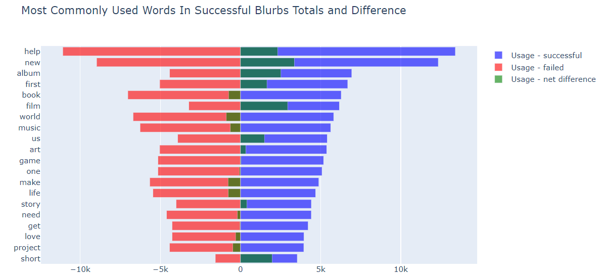
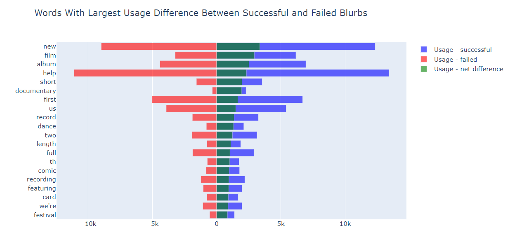

# KickStarter - NLP Sentiment Analysis and Word Usage or: Help Us to Film a New, Short, Documentary about a Tabletop Miniature Festival (which I am slightly unhappy about)

The dataset for this project contains the English blurb or description of 215513 kickstarter's projects in 2017; 108310 successful and 107203 failed. All this data was collected by webrobots.io, who performed the web scraping. They cleaned and tidied the scraped data, keeping just the two columns with blurbs in english and with final state of "successful" or "failed". My analysis builds on this cleaned state.

> Kickstarter is an American public-benefit corporation based in  Brooklyn, New York, that maintains a global crowdfunding platform  focused on creativity and merchandising. The company's stated mission is to "help bring creative projects to life". Kickstarter has reportedly received more than $1.9 billion in pledges from 9.4  million backers to fund 257,000 creative projects, such as films, music, stage shows, comics, journalism, video games, technology and food-related projects. People who back Kickstarter projects are offered tangible rewards or experiences in exchange for their pledges. This model traces its roots to subscription model of arts patronage, where artists would go directly to their audiences to fund their work.

<b>- Wikipedia</b>

The goal of this notebook is to perform sentiment and word usage analysis on successful and failed blurbs, to visualize the results and identify trends in blurb writing that may be useful for future Kickstarter blurb writers.

Data Visualization performed using Plotly

## Sentiment Analysis

NLTK's Vader Sentiment Analyzer [1] is used to score blurbs on Positive, Neutral or Negative sentiment and a Compound score for overall sentiment.

Kickstarter blurbs tend to use positive language, even where the language is not identifiably positive it is more likely to be neutral than negative. Kickstarter blurbs are asking for money so does it "pay" to be upbeat?

The difference is slight but successful kickstarters actually have a higher proportion negative and neutral blurbs that than failed blurbs

Although these donut charts represent different proportions of the total dataset there is an increase in the proportion of successful kickstarters from positive to neutral sentiment and a further increase from neutral to negative sentiment. 

The Sentiment Distribution for Successful and Failed blurbs are show above, the spike at 0 reflects the Neutral Compound scored blurbs where no positive or negative sentiment was found.

Correlation Matrix and Heatmap indicate a very slight negative correlation between compound sentiment and successful blurbs and slight slighlt positive correlation between engative and neutral sentiment and successful blurbs

## Word Usage Analysis

blurbs are tokenized using NLTK's Tokenizer tool. Stopwords, punctuation and numbers are all removed.  Word Frequency is determined and compared for Successful and Failed blurbs.

The most commonly used words most used in successful blurbs has a lot of crossover with the most commonly used words in failed blurbs.

Some words, however, are used much more frequently by the successful blurbs than the failed blurbs. Two measures of this are below. The words with the highest net difference in usage by successful blurbs minus failed blurbs and the words with the highest ratio of usage by successful blurbs over failed blurbs (with a minimum usage of 500)

Notes on word meanings: 
"th" is most like a leftover from removing the numbers eg. "4th" becomes just "th". From the above charts this would indicate successive campaigns i.e those that merits a 4th campaign have 3 prior successful campaigns and therefore are likely to have returning backers.
"mm" may relate to miniatures and tabletop games, which are have very high success to failure differences and ratios 

## Conclusions

The Sentiment of Kickstarter blurbs is mostly positive, however this seems to actually be detrimental to success as demonstrated in the t-test. 
Interestingly, things that are "new" and "first" have high positive success differences and so do successive projects to previous kickstarters i.e things that merit a 'th'. Being both new AND repetitious are postive attributes  
"Tabletop", "miniature" and "dice" have incredibly high success rates as do "film", especially a "documentary", as do "dance" projects. 
"Us" and "We're" both have significant positive differences and ratios indicating backers are in favour of group efforts. 
Phrasing does appear to matter somewhat - "music" projects are mostly unsuccessful but "albums" are mostly successful.  

Asking to <b>"help us film a new, short, documentary about a tabletop miniature festival" </b> is a sure-fire hit! 

[1] Hutto, C.J. & Gilbert, E.E. (2014). VADER: A Parsimonious Rule-based Model for Sentiment Analysis of Social Media Text. Eighth International Conference on Weblogs and Social Media (ICWSM-14). Ann Arbor, MI, June 2014.